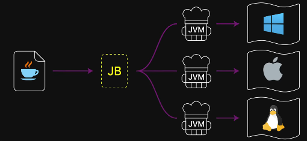

# JVM

> JVM(Java Virtual Machine) 자바 가상 머신
> 

→ 자바 프로그램을 실행하기 위한 가상 컴퓨터이며, 자바 바이트 코드를 컴퓨터가 이해하는 언어로 변환하여 실행하는 주방장 역할을 한다.

- 가상 머신? 자바는 JVM이라는 소프트웨어로 구현된 가상 컴퓨터 위에서 돌아간다.
    
    → JVM은 하드웨어를 추상화한다. 덕분에 개발자는 CPU의 아키텍처나 OS의 종류를 신경 쓰지 않고 JVM 규격에만 맞춰 코드를 짜면 된다. 이것이 자바의 이식성을 완성하는 중요한 요소이다.
    
    
    

이로 인해서 자바의 슬로건인 Write Once, Run Anywhere(한 번 쓰고 어디서든 실행한다.)를 가능하게 하는 핵심 기술이라고 볼 수 있다.

안드로이드 앱 개발이나 스프링 부트 서버 프로그래밍 시 자바뿐 아니라 코틀린 등도 사용할 수 있다.

최근에는 JVM 외에도 많은 다른 언어들이 각각의 가상 머신을 사용하여 동작하고 있으며, 가상 머신 사용은 더 이상 자바만의 강점은 아니다.

- 자바 소스 코드(.java)를 컴파일하면 컴퓨터가 바로 읽을 수 없는 바이트코드(.class)가 생성된다. JVM이 바이트코드를 읽어서 운영체제가 이해할 수 있는 기계어로 번역하고 프로그램을 실행한다.
    - 프로그래밍 언어는 코드(컴파일)를 번역하는지, 통역(인터프리트)하는지에 따라 구분된다.
    - 컴파일: 프로그래밍 언어로 작성된 코드를 실행 전에 컴퓨터가 읽을 수 있는 언어로 미리 번역해 두는 작업이다
        
        
        
    - 인터프리트: 프로그램을 컴파일 결과물 없이, 명령어 단위로 해석과 실행을 반복하는 실행 방식이다.
        
        
        
    - JVM은 자바 외에도 코틀린, 스칼라, 그루비, 클로저 등 자바 바이트코드로 컴파일되도록 만들어진 다른 언어들도 실행 할 수 있다.
    
- JVM 외에도 JRE JDK과 있으며 이 셋은 포함 관계를 이루며 자바 프로그램의 실행과 개발을 담당한다.
    
    
    
    - JVM는 실제 실행을 담당한다.
        - 자바 소스코드로부터 만들어지는 자바 바이너리 파일(.class)을 실행한다.
            - 바이너리 코드를 읽는다.
            - 바이너리 코드를 검증한다.
            - 바이너리 코드를 실행한다.
    - JRE(Java Runtime Environment)는 JVM과 표준 라이브러리를 묶은 실행 환경이다.
        
        
        
        - 자바로 작성된 코드를 실행하러면 컴퓨터에 JRE가 설치되어 있어야 한다.
        - 표준 라이브러리를 핵심적으로 포함한다.
            - 표준 라이브러리는 산술, 출력, 통신 등 널리 사용되는 기초 필수 기능들을 개발자가 직접 구현하지 않아도 되도록 미리 제공하는 수많은 코드 모음이다.
        - 예전에는 JRE만 따로 설치했으나 최근에는 JDK 전체를 다운로드 하도록 되어 있다.
    - JDK(Java Development kit)는 컴파일러와 디버거 등 개발 도구를 포함한 개발 키트이다.
        
        
        
        - 자바 컴파일러: 개발자가 작성한 코드를 JVM이 읽을 수 있는 자바 바이트코드로 바꿔준다.
        - 디버거: 프로그램을 실행을 일시 중단하고, 변수 또는 메모리, 흐름을 관찰하여 오류의 원인을 추적하는 도구이다.
        - 자바로 코딩한 컴퓨터나 자바로 코딩한 스프링 서버를 돌릴 컴퓨터에는 JDK를 설치해야 한다.

## JVM이 하는 일

1. 클래스 로딩(Class Loading)
    
    → Java 바이트코드를 JVM 안으로 읽어오는 단계
    
2. 검증(Bytecode Verification)
    
    → 안정성과 유효성 검사를 해서 위험한 코드가 실행되는 것을 막아준다.
    
3. 실행(Execution)
    
    → JVM 내부의 실행 엔진이 바이트코드를 실제 명령으로 처리해준다.
    
4. 메모리 관리 + 가비지 컬렉션(Garbage Collection)
    
    → 필요한 객체만 메모리에 유지하고, 더 이상 쓰이지 않는 객체는 자동으로 정리해준다.
    

## JVM이 필요한 이유

- 운영체제마다 실행 방식이 다르다.
    - C/C++: Windows용 프로그램은 리눅스에서 그대로 실행 불가
    - CPU 구조마다 기계어가 다르다.
    
    JVM 덕분에 개발자는 OS를 신경 쓰지 않고 Java 코드 작성이 가능하다.
    
- 메모리 관리의 위험
    
    C/C++에서는 
    
    - 메모리 누수
    - 잘못된 포인터 접근
    - 해제된 메모리 사용
    
    위 같은 문제가 자주 발생한다. 
    
    그래서 JVM이 메모리 전체를 통제 해주기 때문에 개발자는 객체 생성만 신경 쓰면 된다.
    

### JIT(Just-In-Time) 컴파일러

> 인터프리터의 한계를 넘는 법
> 

→ 자바가 빨라진 이유중에 하나이다. 인터프리터의 단점을 해결하기 위한 방법으로 런타임 시간에 한꺼번에 컴파일하여 실행한다.

- JVM은 기본적으로 인터프리터 방식으로 실행을 시작하며, 반복 실행되는 코드에 대해 JIT 컴파일러가 기계어로 변환해 성능을 최적화한다.
- 실행 시점에 코드의 패턴을 분석하여 최적화를 수행하기 때문에 어떤 면에서 미리 컴파일하는 C언어보다 특정 상황에서 더 빠를 수도 있다는 점이다.

## JVM 메모리

> 프로그램이 실행되는 동안 데이터와 실행 상태를 질서 있게 보관, 관리하는 논리적 저장 공간들의 체계이다.
> 

즉 JVM이 운영체제의 실제 RAM 위에 만든 ‘가상 메모리 체계’이다.

- 프로그램 데이터를 질서 있게 분류해서 보관
    - 용도별로 나눠서 보관한다.
    
    | **Heap** | 객체, 배열 | 공용 저장소 + GC 관리 |
    | --- | --- | --- |
    | **Stack** | 메서드 실행 정보 | 빠른 호출/반환 |
    | **Method Area** | 클래스 설계도 | 타입 정보 중앙 관리 |
    | **PC Register** | 현재 실행 위치 | 스레드 추적 |
    | **Native Stack** | C/C++ 연동 | OS 자원 접근 |
- 힙 영역에는 동적으로 생성된 객체가 저장되는 영역이다.
    - new 연산을 통해 동적으로 생성된 인스턴스 변수가 생성된다.
        
        → 클래스의 객체 배열 등이 해당된다.
        
    - 가비지 컬렉션의 대상이 되는 공간이다.
- 스택 영역에는 지역 변수, 메소드의 매개변수, 임시적으로 사용되는 변수, 그리고 메소드의 정보가 저장되는 영역이다.
    - 주로 금방 사용되고 사라지는 데이터가 저장되는 영역이다.
- 메소드 영역은 JVM이 시작될 때 생성되는 공간이다.
    - 메서드의 바이트 코드가 이 영역에 저장된다.
    - 클래스와 변수의 정보가 저장된다.
    - static 키워드로 선언한 공유 변수가 저장된다.
- PC 레지스터는 쓰레드가 시작될 때 생성되며, 현재 수행 중인 명령어의 주소를 저장하는 공간이다.
    - 쓰레드가 어떤 부분을 명령어로 수행할지를 저장하는 공간이다.
- Native 메소드 스택은 자바가 아닌 다른 언어로 작성된 코드를 위한 공간이다.
    - C/C++ 등으로 작성된 코드를 수행하기 위한 공간이며, 자바 프로그램 컴파일로 생성된 바이트 코드가 아닌 실제 실행 가능한 기계어로 작성된 프로그램을 실행시키는 영역이다.
    
    
    
- 프로그램 실행을 ‘시간 흐름’대로 관리
    - JVM 메모리는 단순 저장이 아니라 실행을 추적한다.
        
        → 이 관리 덕분에 프로그램이 멈추지 않고 정확히 되돌아갈 위치를 안다.
        
- 자동 메모리 정리(Garbage Collection) 수행
    
    C/C++과 차이점이 여기서 발생한다.
    
    - C/C++은 개발자가 직접 메모리를 해제한다.
    - Java는 JVM이 자동 정리해준다.
    
    작동 원리
    
    - 객체가 생성 → Heap에 저장
    - 더 이상 참조되지 않음 → “쓰레기” 판정
    - GC가 수거해서 메모리 반환
    
    이런 식의 작동으로 얻은 결과는
    
    - 메모리 누수 감소
    - 프로그램 안정성 증가
    - 서버 운영이 훨씬 안전해짐
    
    → 이것이 Java가 대기업, 금융, 공공 시스템에서 강한 이유다.
    

### 메모리의 효율적 분할(TLAB과 GC)

→ JVM은 메모리를 단순히 스택과 힙으로 나누는 데 그치지 않고 성능 향상을 위해 내부 구조를 더 세분화했다.

- Heap의 세분화
    
    → 힙은 **Young Generation**과 **Old Generation으로 나눌 수 있다.**
    
- 스택의 독립성
    
    → 스택은 Thread(스레드)별로 독립적으로 생성된다. 반면에 힙과 메소드 영역은 모든 스레드가 공유한다.